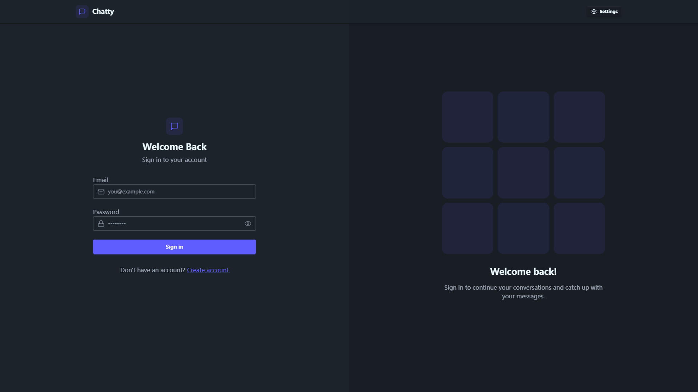
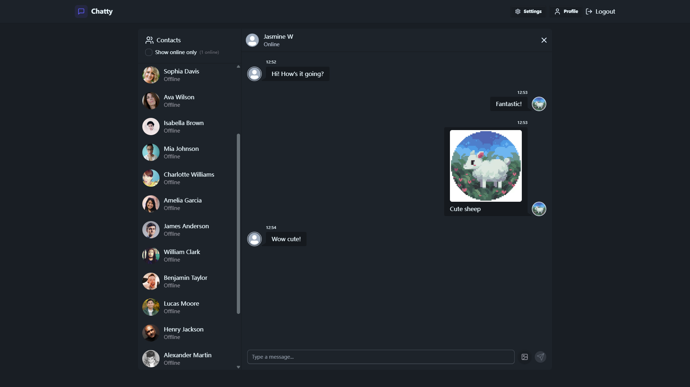

# 🚀 ClickChat - Realtime Chat App

A real-time chat application built with MERN stack, powered by Socket.io. Supports authentication, profile management, theme customization, and live messaging.





---

## 🔥 Features

✅ **Authentication & Authorization** – Secure email signup/login with JWT  
✅ **Real-time Messaging** – Powered by **Socket.io** for instant updates  
✅ **Profile Management** – Upload & change profile picture  
✅ **Online Status** – See who’s online in real-time  
✅ **Theme Customization** – 32 dynamic themes with **DaisyUI**  
✅ **Image Uploading & Sharing** – Store and share images via **Cloudinary**  
✅ **Global State Management** – Using **Zustand**  
✅ **Responsive UI** – TailwindCSS-powered modern interface  

---

## 🛠️ Tech Stack

- **Frontend:** React + TailwindCSS + DaisyUI  
- **Backend:** Node.js + Express + MongoDB  
- **Realtime:** Socket.io  
- **Authentication:** JWT  
- **State Management:** Zustand
- **Media Storage:** Cloudinary

---

## 🎬 Quick Start

1. Clone the repo:  
   ```sh
   git clone https://github.com/Aqua0812/ClickChat_ChatApp.git
   ```
2. Set up your **.env** file with database and JWT credentials.
   ```env
   MONGODB_URI=...
   PORT=5001
   JWT_SECRET=...

   CLOUDINARY_CLOUD_NAME=...
   CLOUDINARY_API_KEY=...
   CLOUDINARY_API_SECRET=...
   
   NODE_ENV=development
  
3. Build the app:  
   ```sh
   npm run build
   ```
4. Start the app:
   ```sh
   npm start
   ```
5. Enjoy real-time chatting! 🎉  

---
## 📌 Credits & Acknowledgements

This project was **inspired by [Burak Orkmez's tutorial](https://github.com/burakorkmez/fullstack-chat-app.git)**.  Special thanks for the amazing guide! 🎉  

---
